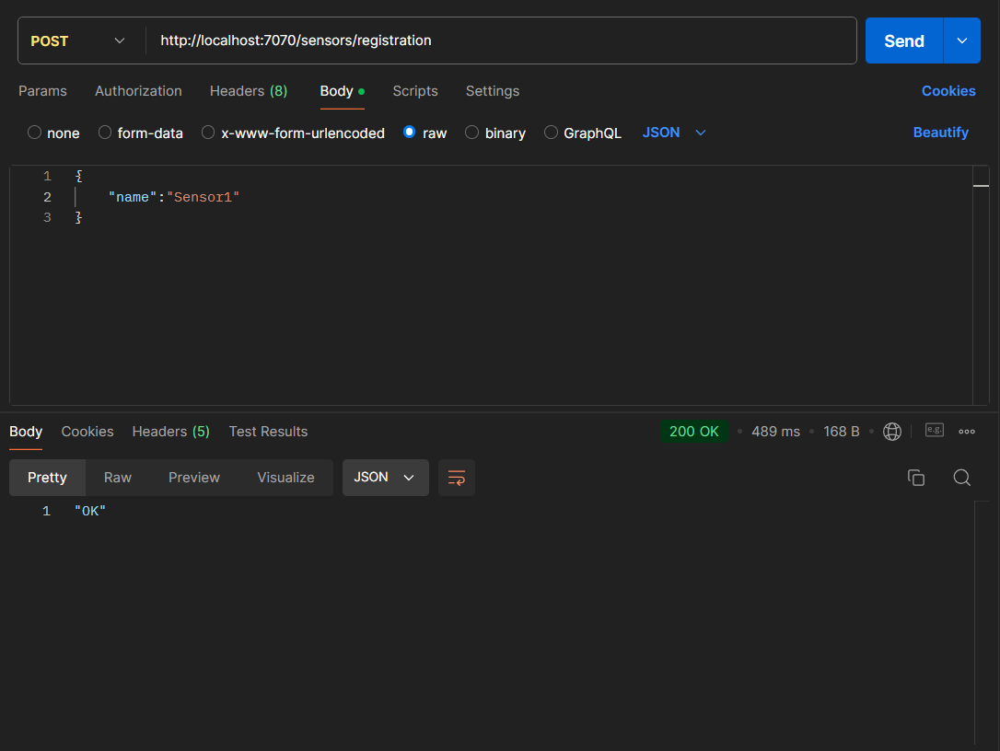
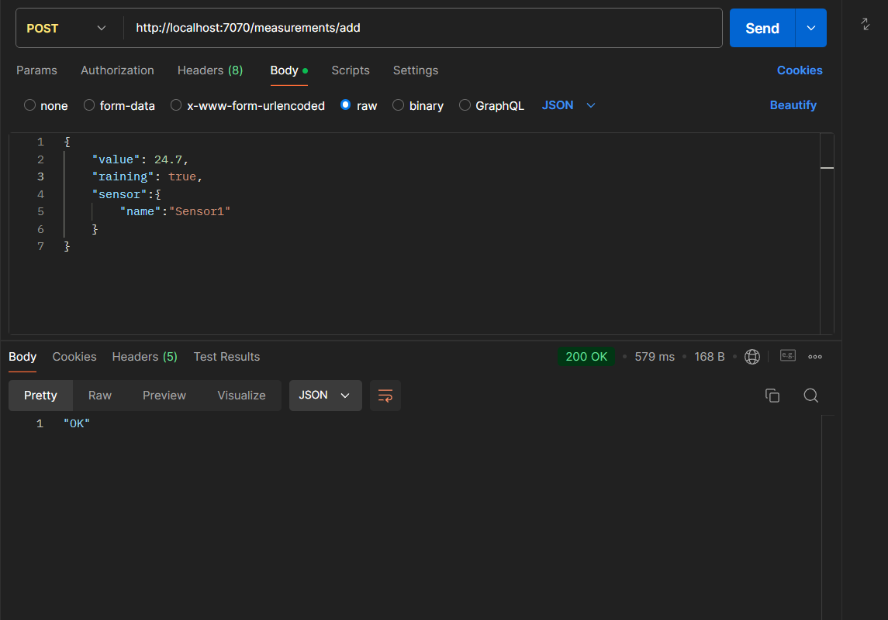
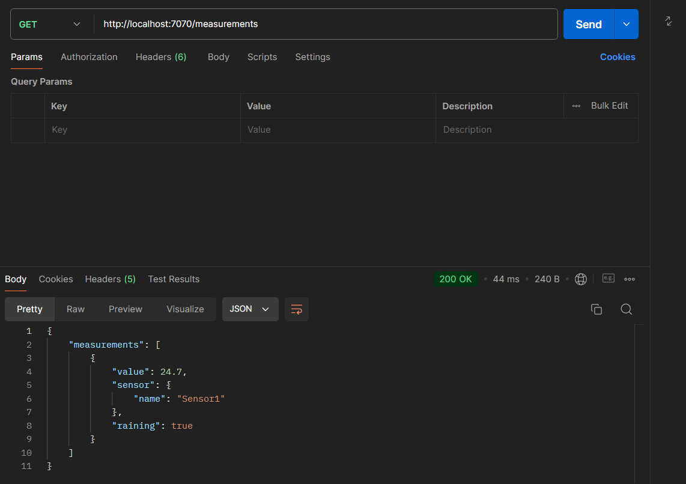
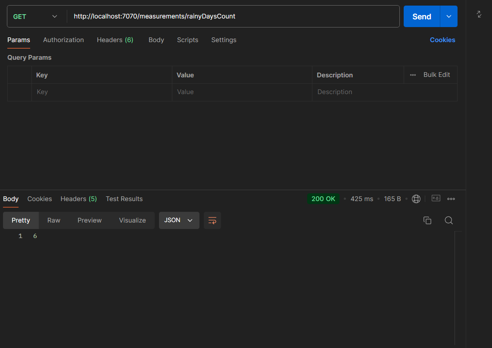
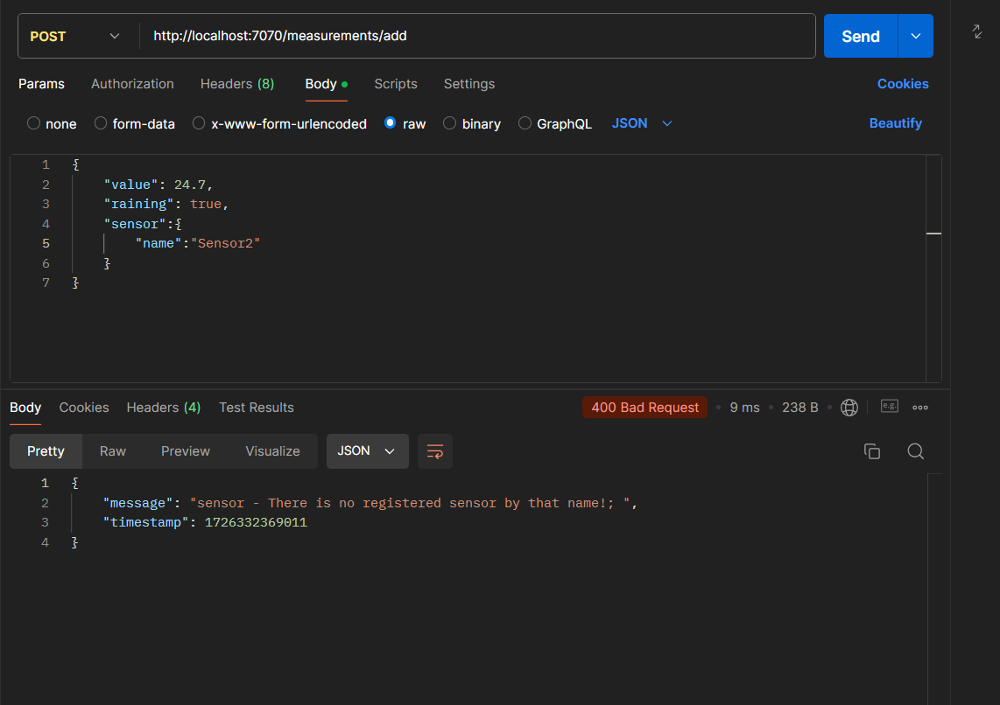
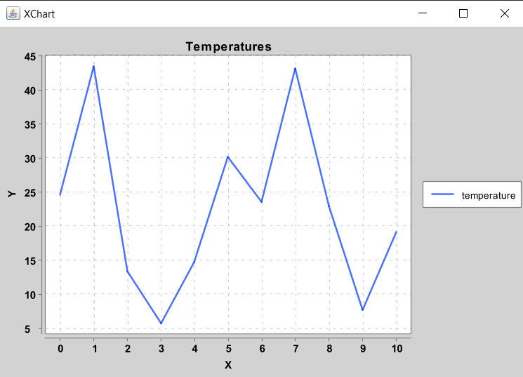
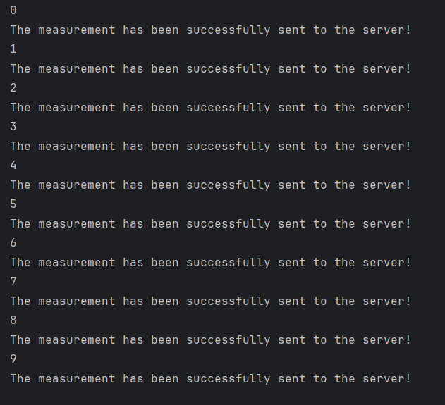

**REST API СЕРВИС**
---
### Задачи проекта:
Задание разделено на части: 
+ Cоздать REST API приложение с помощью Spring REST
+ Создать Java клиента, который отправляет данные на
REST API приложение
+ Построить график температур, получив значения с сервера.
---
#### REST API приложение:
Всего в приложении 4 адреса.
1. Регистрация сенсора:
+ Регистрация нового сенсора в системе.
+ Для входящих объектов используется DTO
+ Все поля валидируются
2. Добавление измерения от сенсора:
+ Адрес, куда сенсор посылает свои данные. Вещественное поле "value" содержит значение температуры воздуха, булево поле "raining" содержит значение true/false в зависимости от того, зарегистрировал ли сенсор дождь или нет.
+ В каждой строке таблицы содержится название сенсора, который отправляет данные.
+ Все поля валидируются.
3. Получение всех измерений:
+ Возвращает все измерения из БД
4. Получение количества дождливых дней:
+ Возвращает количество дождливых дней из БД
---
#### Java клиент:
1. Чтобы отправлять запросы со
случайными температурами и "дождями" на адрес, используется класс RestTemplate.
2. При помощи библиотеки xchart на основании полученных температур строится график.
---
#### Демонстрация работы:
+ Добавление нового сенсора:

+ Добавление значений сенсора:

+ Получение всех измерений:

+ Получение количества дождливых дней:

+ Валидация:

+ График, построенный на полученных температурах:

+ Отправление запросов с данными при помощи Java клиента:

### Использованные технологии:
1. Java
2. Spring
3. Spring Boot
4. Spring REST API
5. Hibernate
6. Spring Data JPA
7. Maven
8. PostgreSQL
9. Spring Validator
10. Xchart
---
Артём Хасровьян.
Контакты:[Телеграм](https://t.me/mamin_biker) 